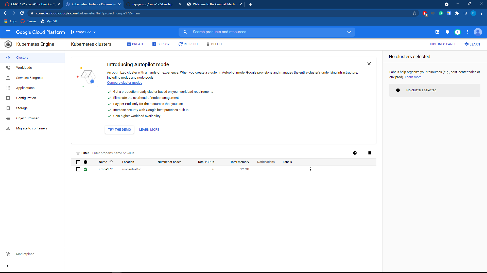

# spring-gumball ci/cd example

# CMPE 172 - Lab #10 Notes
I put my lab 10 notes and images here as well just in case these notes were not supposed to go in the private repo.

## Part 1 - Screenshots for CI Workflow
### New Java CI with Gradle Action

### Creating a CI Workflow

## Part 2 - Screenshots for CD Workflow
### New GKE Action

### Creating a CD Workflow

### Updating deployment.yaml

### GCP Service Account

### JSON Service Account Key

### Github Action Secrets

### My Cluster

### Creating a New Release

### All Workflows

### The CD Deployment Trigger

### My Workloads

### My Services

### Creating an Ingress

### Ingress Created Successfully

### Opening the Gumball Webpage on GKE

## Discussion
I first ran into some issues after my release triggered the CD workflow. This was caused by me incorrectly assigning GKE_SA_KEY. I only used the private key portion of the JSON file instead of the whole thing. After pasting in the whole thing, I ran into another error. This error was caused by my service account not having owner permissions. After creating an owner level service account, all of the steps in the CD workflow ran fine.
### Release Failed Screenshot
